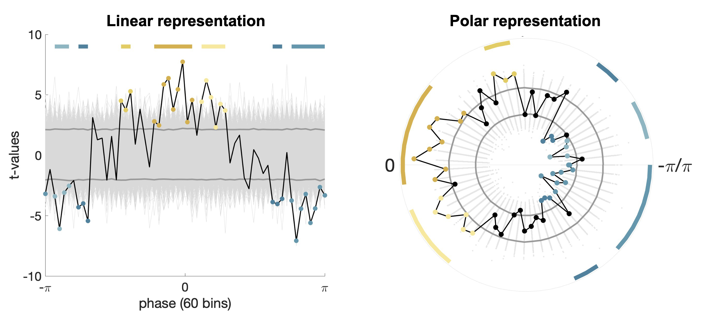

# respmethods - Robust circular cluster-based statistics for respiration-brain coupling
Robust pipeline for respiration phase-locked analyses of neural or behavioral data across the frequency spectrum, including a circular cluster permutation procedure reliably controlling error rates for multiple comparisons while accounting for the wrap-around continuity of circular data.

## Reference:
Berther, T., Balestrieri, E., Saltafossi, M., Paulsen, L. B., Andersen, L. M., Kluger, D. S. (2025). Robust circular cluster-based statistics for respiration-brain coupling. _PsyArXiv_, 2025-11.

Please cite this paper when the provided code is used.

## Contents:

#### Functions
- ``CircClust`` cluster circular data points using complex representations in the polar plane
- ``CircPerm`` permutation test clusters in circular data
- ``two_point_interp``extract phase of an oscillatory time series using the two-point interpolation method
- ``four_point_interp``extract phase of an oscillatory time series using the four-point interpolation method
- ``protohase_interp`` extract phase of an oscillatory time series using the protophase interpolation method, adapted from the [DAMOCO toolbox](http://www.stat.physik.uni-potsdam.de/~mros/damoco.html) (C) Björn Kralemann, Michael Rosenblum, Arkady Pikovsky, University of Potsdam 

##### Required, included functions 
- ``generate_surrogate_iaaft``generates a phase-independent surrogate of a time series using the Iterative Amplitude-Adjusted Fourier Transform, (C) Alessio Perinelli & Leonardo Ricci, NSE Laboratory, Department of Physics, University of Trento ([github](https://github.com/LeonardoRicci/iaaft))
- ``PLV``computes the phase-locking value between two signals, (C) Edden Gerber, Edmond and Lily Safra Center for Brain Sciences, Hebrew University of Jerusalem, Israel ([github](https://github.com/edden-gerber/time_series_analysis_and_statistics))

#### Scripts
- ``DataPrep.m`` pipeline for respiratory phase extraction, surrogate generation using IAAFT, and binning of behavioral data into respiratory phase bins
- ``ExampleCircPerm.m`` demo script for circular permutation test on example empirical and simulated data, generates linear and polar plots of the results

#### Example plots for results of circular cluster permutation test on randomly simulated data: 

## Authors:
Teresa Berther, Elio Balestrieri, Daniel S. Kluger & Martina Saltafossi, Institute for Biomagnetism and Biosignal Analysis, University of Münster, Germany

Contact: teresa.berther@uni-muenster.de

## Disclaimer:
The code in this repository was implemented with care and tested on both empirical and simulated data. Nevertheless, it may contain errors or bugs, which may affect the outcome of your analysis. We do not take responsibility for any harm coming from using the provided code, neither caused by errors in the code nor by its improper application. Please email us any bugs you find.
